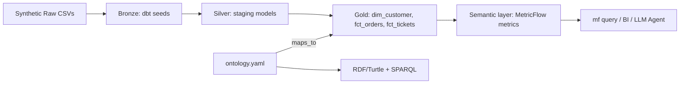

# Retail Customer 360: Ontology-Driven Semantic Layer


A portfolio project for a Senior Data Engineer role demonstrating how raw transactional data becomes a governed dimensional model, an **ontology** defines business terms and relationships, and a **semantic layer (dbt MetricFlow)** serves a single governed definition for core enterprise KPIs.

> [!IMPORTANT]
> **Headline Problem Solved:** Marketing, Finance, and Support each report an "active customer" count, yet raw SQL queries produce **three conflicting numbers (524 vs 825 vs 299)**. This repository codifies ADR-001 to standardize a canonical metric while keeping named departmental variants transparently accessible.

---

## Architecture Diagram



---

## Data Model vs Ontology vs Semantic Layer

| Concept | Answers | Implementation |
| :--- | :--- | :--- |
| **Data Model** | How is data stored? | DuckDB `dim_customer`, `fct_orders`, `fct_tickets` tables |
| **Ontology** | What do things *mean* and how do they relate? | Machine-readable `ontology/ontology.yaml` + OWL/RDF Turtle (`ontology.ttl`) |
| **Semantic Layer** | How do we compute numbers consistently? | dbt MetricFlow (`models/marts/semantic.yml`) defining metrics once |

---

## Empirical Results: Before vs. After

### Before (Un-governed Data Model Query)
Direct query on physical mart flags showing 3 conflicting counts for the exact same date (`2026-06-30`):

```
==========================================================================
  Raw Data Model Conflicting Counts (The Headline Business Problem)
==========================================================================
 active_marketing_90d  active_finance_365d  active_support_30d
                524.0                825.0               299.0
==========================================================================
```

### After (MetricFlow Governed Semantic Query)
Running `mf query --metrics active_customers,active_customers_365d,engaged_customers_30d --group-by customer__segment`:

```
customer__segment      active_customers    active_customers_365d    engaged_customers_30d
-------------------  ------------------  -----------------------  -----------------------
consumer                            167                      269                      100
enterprise                          182                      275                      103
small_business                      175                      281                       96
```

All three departmental metrics are defined in **one single location** (`models/marts/semantic.yml`), preventing SQL logic duplication across dashboards.

---

## Quickstart & How to Run

### 1. Prerequisites & Installation
```bash
# Clone and setup project
git clone <your-repo-url> retail-semantic-layer
cd retail-semantic-layer

# Create & activate virtual environment
python -m venv .venv
# Windows PowerShell:
.venv\Scripts\activate
# Linux/macOS:
source .venv/bin/activate

# Install dependencies
pip install dbt-duckdb dbt-metricflow faker rdflib pytest pandas pyyaml
```

### 2. Configure Environment
```bash
# Set dbt profile location (Windows PowerShell)
$env:DBT_PROFILES_DIR="."
$env:PYTHONIOENCODING="utf-8"

# Verify connection
dbt debug
```

### 3. Generate Data & Run Data Pipeline
```bash
# Step 3: Generate synthetic CSVs
python data_gen/generate.py

# Step 4: Run Bronze, Silver, Gold models & Data Quality Tests
dbt seed
dbt run
dbt test

# Verify raw definition conflict
python data_gen/check_conflict.py
```

### 4. Build RDF Knowledge Graph & SPARQL
```bash
# Step 6: Export ontology to OWL/RDF Turtle and execute SPARQL query
python ontology/build_rdf.py
```

### 5. Validate & Query MetricFlow Semantic Layer
```bash
# Step 7: Validate configs & list metrics
mf validate-configs
mf query --metrics active_customers,active_customers_365d,engaged_customers_30d --group-by customer__segment
mf query --metrics total_revenue --group-by metric_time__month
```

### 6. Run Governance Unit Tests
```bash
# Step 8: Assert physical schemas match ontology and metrics
pytest -v
```

### 7. Run Text-to-Semantic LLM Benchmark
```bash
# Step 10: Run natural language query translator benchmark
python data_gen/llm_query_demo.py
```

---

## Key Architectural Decisions (ADR)

See [`docs/03_ontology_design.md`](docs/03_ontology_design.md) for full context:
- **ADR-001 (Accepted):** Canonical "Active Customer" is defined as a completed order in the past 90 days (Marketing view). Finance (365 days) and Support (30 days) views are preserved as explicit named metric variants (`active_customers_365d` and `engaged_customers_30d`).
- **Why DuckDB:** Zero-dependency, file-based embedded OLAP database running locally on a laptop with ultra-fast execution.
- **Why MetricFlow:** Standard open-source semantic engine integrated with dbt that constructs dynamic SQL join graphs without manual SQL duplication.

---

## Automated CI/CD Governance Testing

This repository includes a GitHub Actions workflow (`.github/workflows/ci.yml`) that validates schema contracts on every commit:
- `test_every_property_maps_to_a_real_column`: Fails if `ontology.yaml` points to a non-existent physical column.
- `test_every_definition_metric_exists_in_semantic_layer`: Fails if an ontology definition references a metric absent from MetricFlow.

---

## Limitations & Next Steps
- **YAML-first Ontology:** Production enterprise knowledge graphs (e.g., Palantir Foundry, Enterprise Knowledge Graphs) use graph databases (Neo4j, Stardog) and ontology management UI platforms.
- **Next Steps:** Connect MetricFlow API to Apache Superset or Lightdash dashboards for real-time visualization.

---

## Repository Directory Map

```
retail-semantic-layer/
├── .github/workflows/ci.yml     # Automated CI pipeline
├── data_gen/
│   ├── generate.py              # Reproducible Faker synthetic dataset generator
│   ├── check_conflict.py        # Query demonstrating raw metric conflict
│   ├── run_mf_test.py           # Cross-platform MetricFlow CLI runner
│   └── llm_query_demo.py        # Text-to-Semantic-Layer benchmark agent
├── docs/
│   ├── 01_business_problem.md   # Business problem statement & departmental conflict
│   ├── 02_data_model.md         # Grain and schema documentation for Gold marts
│   ├── 03_ontology_design.md    # ADR-001 and OWL/RDF SPARQL documentation
│   └── 04_semantic_layer.md     # Metric catalog & semantic governance rationale
├── models/
│   ├── staging/                 # Silver models (stg_customers, stg_orders, stg_tickets)
│   └── marts/                   # Gold models (dim_customer, fct_orders, fct_tickets)
│       ├── metricflow_time_spine.sql # MetricFlow calendar spine
│       ├── schema.yml           # Data quality tests (unique, not_null, accepted_values)
│       └── semantic.yml         # MetricFlow semantic model & metric definitions
├── ontology/
│   ├── ontology.yaml            # YAML domain ontology definition
│   ├── build_rdf.py             # RDF/Turtle exporter & SPARQL query runner
│   └── ontology.ttl             # Exported OWL/RDF Turtle knowledge graph
├── seeds/                       # Raw seed CSV files
├── tests/
│   └── test_ontology.py         # Pytest schema governance test suite
├── dbt_project.yml              # dbt project config
├── profiles.yml                 # DuckDB connection profile
├── pytest.ini                   # Pytest options
└── README.md                    # System architecture & documentation
